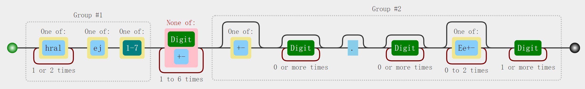

<div align="center">

## DM

</div>

### Parser



### Tree

```txt
.
├── Cargo.lock
├── Cargo.toml
├── README.md
├── assets
│   ├── out
│   │   ├── test.skl
│   │   └── test.txt
│   ├── pcap
│   │   └── long.pcapng
│   └── test
└── src
    ├── data.rs
    ├── main.rs
    ├── lib.rs
	├── ui.rs
    ├── parser.rs
    └── target.rs
```

### Usage

#### main.rs
```rust
// 读取数据，需提供路径和完整文件名
let mut target = Target::from_editor("assets/test.edit");
let mut target = Target::from_params("assets/out/test.txt");
let mut target = Target::from_pcap("assets/pcap/long.pcapng");

// 写入文件，无需提供路径和文件后缀
target.into_skl("test");
target.into_editor("test");
target.into_skl_txt("test");
```

#### GUI

* Input :  点击 “云” 图标选择文件或者将文件直接拖入“云”图标（支持格式：`pcapng` ,`txt`,`edit`,具体见#Format ）
* Output : 左侧第一个按钮选择输出格式，run按钮执行


#### 选取关节

```Rust
// src/data.rs/pub fn get_joint_idx(){}
pub fn get_joint_idx(joint_name: &str) -> usize {
    match joint_name as &str {
        // "la1" => 0, // 丢弃la1
        "la2" => 1,    // 选择la2
        "la3" => 2,
        "la4" => 3,
        "ll1" => 4,
        ···
        "ra3" => 18,
        "ra4" => 19,
        "wait" => 20,
        _ => usize::MAX,
    }
}
```


### Format

#### 说明
```txt
test_s0_ll4
test：文件名（技能名） 
s0：state0
ll4：关节名
```

约定后缀为 `state(i)_jointName`

#### .skl
```txt
STARTSKILL SKILL_TEST_LEFT_LEG

STARTSTATE
settar EFF_LA1 $test_s0_la1 EFF_LA2 $test_s0_la2 EFF_LA3 $test_s0_la3 EFF_LA4 $test_s0_la4 EFF_LL1 $test_s0_ll1 EFF_LL2 $test_s0_ll2 EFF_LL3 $test_s0_ll3 EFF_LL4 $test_s0_ll4 EFF_LL5 $test_s0_ll5 EFF_LL6 $test_s0_ll6 end
settar EFF_RL1 $test_s0_rl1 EFF_RL2 $test_s0_rl2 EFF_RL3 $test_s0_rl3 EFF_RL4 $test_s0_rl4 EFF_RL5 $test_s0_rl5 EFF_RL6 $test_s0_rl6 EFF_RA1 $test_s0_ra1 EFF_RA2 $test_s0_ra2 EFF_RA3 $test_s0_ra3 EFF_RA4 $test_s0_ra4 end
wait 0.02 end
ENDSTATE

... ...

ENDSKILL

REFLECTSKILL SKILL_TEST_LEFT_LEG SKILL_TEST_RIGHT_LEG
```

#### .txt
```txt
test_s0_la1	-83.120976875
test_s0_la2	14.24550625
test_s0_la3	-69.99999969174813
test_s0_la4	-15.000000391325
test_s0_ll1	-26.4469375
test_s0_ll2	-5.3707625
test_s0_ll3	-29.369374999999998
test_s0_ll4	-26.5866875
... ...
```

#### .edit
```txt
20 0 0 -83.120976875 14.24550625 -69.99999969174813 -15.000000391325 -26.4469375 -5.3707625 -29.369374999999998 -26.5866875 32.9456875 10.5 -19.88 -17.93 14.51 -71.44 44.96 11.94 -83.120976875 -15.7545 69.99999969174813 15.000000391325 0.0 0.0
20 0 0 -84.4669923046875 17.118487890624998 -69.99999967248239 -15.000000415782813 24.56050390625 -3.8064789062499997 23.8502890625 7.733519531250001 -14.90383203125 -3.1456625000000003 -24.46 -15.42 12.97 -70.69 42.85 8.86 -84.4669923046875 -12.881512500000001 69.99999967248239 15.000000415782813 0.0 0.0
```

#### 统一关节顺序
```txt
"la1", "la2", "la3", "la4", "ll1", "ll2", "ll3", "ll4", "ll5", "ll6", "rl1", "rl2","rl3","rl4", "rl5", "rl6", "ra1", "ra2", "ra3", "ra4",
```


